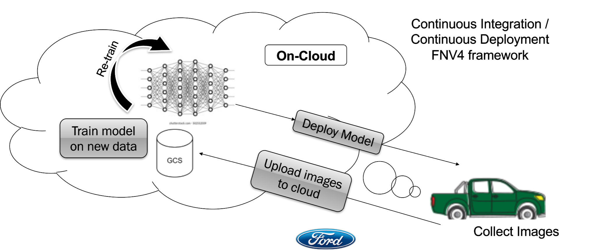

.. FNV4 Features Onboarding documentation master file, created by
   sphinx-quickstart on Sun Nov 13 06:31:37 2022.
   You can adapt this file completely to your liking, but it should at least
   contain the root `toctree` directive.

Welcome to FNV4 Features Onboarding documentation!
====================================================

.. toctree::
   :maxdepth: 2
   :caption: Contents:

   modules

.. toctree::
   :maxdepth: 2
   :caption: Contents:

   introduction
   

Indices and tables
==================

* :ref:`genindex`
* :ref:`modindex`
* :ref:`search`
